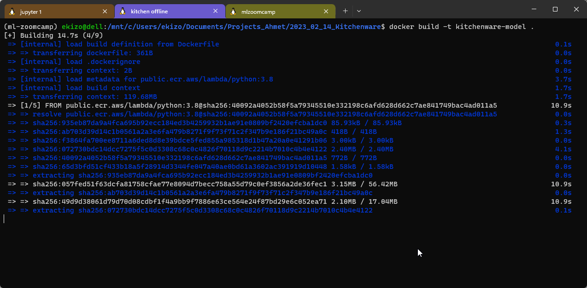

# Kitchanware Classification and Deployment on AWS Lambda

[Kitchenware Items classification competition](https://www.kaggle.com/competitions/kitchenware-classification) organized by [Datatalks.Club](https://datatalks.club/).

In this competition you need to classify images of different kitchenware items into 6 classes:

- cups
- glasses
- plates
- spoons
- forks
- knives

I developed a **ResNet50-based CNN** model to detect **Kitchenware Items** and **deployed** it with **AWS Lambda**.

- My ResNet CNN model that is developed notebook on Kaggle: [Kitchenware Classification Resnet50 | Kaggle](https://www.kaggle.com/code/ahmetekiz/kitchenware-classification-resnet50) (Private Score: 0.9418)

# Files

- [`converting_to_tflite.ipynb`](https://github.com/AhmetEkiz/Kitchanware-Classification/blob/main/converting_to_tflite.ipynb) is the notebook that keras model converted to tflite.
- [`kitchenware-classification-resnet50.ipynb`](https://github.com/AhmetEkiz/Kitchanware-Classification/blob/main/kitchenware-classification-resnet50.ipynb) model development notebook.
- [`lambda_function.py`](https://github.com/AhmetEkiz/Kitchanware-Classification/blob/main/lambda_function.py) lambda function for AWS deployment.
- [Download the my kitchenware tflite model. (It's 117mb)](https://drive.google.com/file/d/1--IOCmhEQV3e8Tv9nqnf3FscxEUD7iM-/view?usp=sharing).

# How to Deploy on AWS Lambda

## Build Docker Image

Build the Docker Image and Run to test the **lambda_fucntion**

```python
docker build -t kitchenware-model .

docker run -it --rm -p 8080:8080 kitchenware-model:latest
```



## test.py

```python
# test.py
import requests

# local url
url = "http://localhost:8080/2015-03-31/functions/function/invocations"

data = {'url' : 'https://images.unsplash.com/photo-1542838309-fbfad201ce6d?ixlib=rb-4.0.3&ixid=MnwxMjA3fDB8MHxzZWFyY2h8Mjh8fGZvcmt8ZW58MHx8MHx8&auto=format&fit=crop&w=500&q=60'}

result = requests.post(url, json=data).json()
print(result)
```

- The test Image:


- From another terminal:

```python
python test.py
```


# Push Docker Image to the AWS ECR

**If you don’t have AWS account, you should read [Machine Learning Bookcamp](https://mlbookcamp.com/) article:** 

- [https://mlbookcamp.com/article/aws](https://mlbookcamp.com/article/aws)

The first thing you need to do is creating repository for **ECR(Elastic Container Registry)**, in order to do that you need to use **`awscli`**.

```bash
pip install awscli

# if you are using for the first time use, configure with IAM user 
aws configure

# creating ecr 
aws ecr create-repository --repository-name kitchenware-tflite-images
```

- Save the output:

```python
{
    "repository": {
        "repositoryArn": "{}:repository/kitchenware-tflite-images",
        "registryId": "123456",
        "repositoryName": "kitchenware-tflite-images",
        "repositoryUri": "123456.dkr.ecr.us-east-1.amazonaws.com/kitchenware-tflite-images",
        "createdAt": 123456.0,
        "imageTagMutability": "MUTABLE",
        "imageScanningConfiguration": {
            "scanOnPush": false
        },
        "encryptionConfiguration": {
            "encryptionType": "AES256"
        }
    }
}
```

- Then go to ECR to check the registery:


- We created repository but it’s empty:
  
    
  
    

- We added the repository. Now, we need to **log in** to publish our Docker image. In order to do this, the command in below will **generate password** for us and **Docker command.**

- [https://docs.aws.amazon.com/cli/latest/reference/ecr/get-login.html](https://docs.aws.amazon.com/cli/latest/reference/ecr/get-login.html)

- [https://awscli.amazonaws.com/v2/documentation/api/latest/reference/ecr/get-login-password.html](https://awscli.amazonaws.com/v2/documentation/api/latest/reference/ecr/get-login-password.html) (this is the new version.)

```bash
aws ecr get-login --no-include-email | sed 's/Expression/ Result(which we want to replace it)/g'

aws ecr get-login --no-include-email | sed 's/[0-9a-zA-Z=]\{20,\}/PASSWORD/g'
```

- `sed`is a command line utility in Linux that allows you to do different text manipulations including regular expressions so this is exactly  what we want to do here so I want to run a regular expression.  ([video](https://youtu.be/kBch5oD5BkY?list=PL3MmuxUbc_hIhxl5Ji8t4O6lPAOpHaCLR&t=210))
  - `sed` will parse the text and look for a string of length 20 containing numbers, upper and lowercase letters and the `=` sign, and replace it with the word `PASSWORD` ([source](https://github.com/ziritrion/ml-zoomcamp/blob/main/notes/09_serverless.md#uploading-to-ecr-cli))
  - {20,\} means at least 20 characters.

### Run the command that created by AWS ECR in above to login:

```bash
$(aws ecr get-login --no-include-email)
```


### Now we need to take this url and edit

```bash
ACCOUNT=123456
REGION=us-east-1
REGISTRY=kitchenware-tflite-images
PREFIX=${ACCOUNT}.dkr.ecr.${REGION}.amazonaws.com/${REGISTRY}

TAG=kitchenware-model-resnet50-001
REMOTE_URI=${PREFIX}:${TAG}
```

- Create the `REMOTE_URI`of your image by attaching a ***tag*** to the end of the repo URI preceded by a colon. ([source](https://github.com/ziritrion/ml-zoomcamp/blob/main/notes/09_serverless.md#uploading-to-ecr-cli))
  
  - Consider the example URI `123456.dkr.ecr.us-east-1.amazonaws.com/my-registry`.
    
    - `123456` is the ***account***.
    - `dkr.ecr` means that the URI belongs to an Amazon ECR private registry.
    - `us-east-1` is the ***region***.
    - `amazonaws.com` is the top domain.
    - `/my-registry` is the directory of the registry we created in step 1.
    - A *tag* is a name you assign to the specific version of the image in use. For our example we'll use `model-001`.
  
  - The resulting `REMOTE_URI` is `123456.dkr.ecr.us-east-1.amazonaws.com/my-registry:model-001`
    
    ### Push our Docker Image to the ECR
    
    ```bash
    # change the tag of container to ${REMOTE_URI}
    docker tag kitchenware-model:latest ${REMOTE_URI}
    docker push ${REMOTE_URI}
    ```
    
    This can take a while.
    
    

- Then go to **CREATE LAMBDA FUNCTION** page.

# Create Lambda Function

- Go to **Lambda** Service:


After successfull creation, test the our **Lambda** function:


- Our code works with url, so we will send it url in json format. But before that you need to configure the Lambda service.
- ⚠️If you test the code first, it is failed! “*Timed out after 3 seconds.*”. Because three seconds is the default timeout which is not sufficient for our case. Which is initializing can take more time than three seconds.
- Also more memory may be needed. So, we will increase the memory to 512MB. And if you get fail, the system will show you what is the reason.


- Then test it:

```json
{
  "url": "https://images.unsplash.com/photo-1542838309-fbfad201ce6d?ixlib=rb-4.0.3&ixid=MnwxMjA3fDB8MHxzZWFyY2h8Mjh8fGZvcmt8ZW58MHx8MHx8&auto=format&fit=crop&w=500&q=60"
}
```


- First time can take more time. Consecutive requests take less time.


# Princing

[https://aws.amazon.com/lambda/pricing/](https://aws.amazon.com/lambda/pricing/)

You can calculate the price with the pricing page. 


$0.0000000083 for per 1ms with 512MB which is our memory size. And our lambda function takes 1447ms.

- If we have 10,000 requests:
  - (10,000requests)* 1500(billed duration) * $0.0000000083 = $0.1245 for our service.
- If we have 1,000,000 requests:
  - (1,000,000requests)* 1500(billed duration) * $ 0.0000000083 = $12.45 for our service.

# API Gateway: exposing the lambda function

- Configure the API Gateway to use others our service.

⚠️But you need to be aware of the API will be public and can be accessable by anyone whihc can lead to abuse. Securing the access to your API falls beyond the scope of this course. 


- We will select **REST API**


# Create a Method


# Test the API


### Send the request with test button on the same page:

```json
{
  "url": "https://images.unsplash.com/photo-1542838309-fbfad201ce6d?ixlib=rb-4.0.3&ixid=MnwxMjA3fDB8MHxzZWFyY2h8Mjh8fGZvcmt8ZW58MHx8MHx8&auto=format&fit=crop&w=500&q=60"
}
```


### Second request in sequence:


# Deploy the API


This will give you an API URL.

# Test from your computer

```python
import requests

# url = "http://localhost:8080/2015-03-31/functions/function/invocations"

# AWS API Gateway
url = "{your AWS API URL}"

data = {'url' : 'https://images.unsplash.com/photo-1542838309-fbfad201ce6d?ixlib=rb-4.0.3&ixid=MnwxMjA3fDB8MHxzZWFyY2h8Mjh8fGZvcmt8ZW58MHx8MHx8&auto=format&fit=crop&w=500&q=60'}

result = requests.post(url, json=data).json()
print(result)
```


# It works! 😊

⚠️You need to be aware of the API will be public and can be accessable by anyone whihc can lead to abuse. Securing the access to your API falls beyond the scope of this repo.